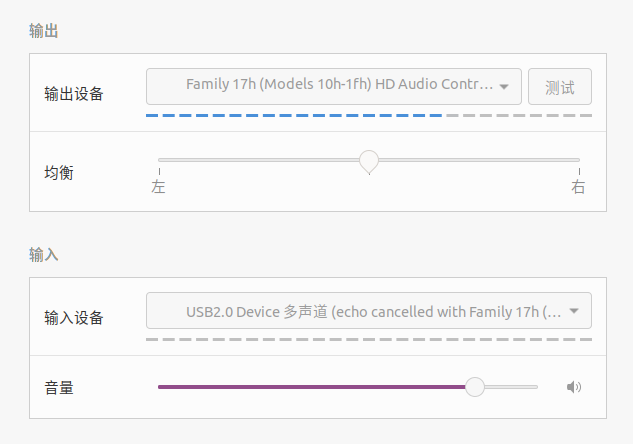

# PulseAudio-AEC-Script脚本说明

本项目提供了一套脚本，用于在基于PulseAudio的Linux系统（如Ubuntu 20.04）上自动配置声学回声消除（AEC）。

此方法完全在用户空间进行，**无需`sudo`权限**，更加安全、简洁，且不会影响系统全局配置。

## 核心原理

本方法通过在用户的个人配置文件（`~/.config/pulse/default.pa`）中加载PulseAudio的`module-echo-cancel`模块来实现AEC。

这会创建一个虚拟的麦克风设备，该设备会过滤掉从扬声器输出的声音，从而达到回声消除的效果。



## 先决条件

1.  **操作系统**: 基于PulseAudio的Linux发行版（已在Ubuntu 20.04上测试通过）。

2.  **硬件**: **强烈推荐使用外置USB麦克风和系统扬声器的组合**。由于物理振动耦合问题，使用笔记本自带的麦克风和扬声器组合通常无法达到理想的AEC效果。

## 安装与配置

我们提供了一个自动化脚本来完成所有配置。

1.  **授予脚本执行权限**

    在终端中，进入项目根目录，运行以下命令：
    ```bash
    chmod +x setup_aec.sh uninstall_aec.sh
    ```

2.  **运行安装脚本**

    直接运行脚本，**请勿使用`sudo`**：
    ```bash
    ./setup_aec.sh
    ```
    脚本会自动检测你所有的麦克风设备，并让你进行选择。请根据提示输入你希望用于AEC的麦克风设备编号（通常是你的USB麦克风）。

3.  **选择音频设备**

    脚本执行成功后，打开你的系统“声音”设置。在“输入”设备列表中，选择名称中带有 **`with Echo Cancellation`** 字样的虚拟麦克风设备。

    从此以后，所有使用此输入设备的应用都会自动获得AEC效果。

## 卸载

如果你希望移除AEC配置，恢复到原始状态，只需运行卸载脚本即可。

**请勿使用`sudo`**：
```bash
./uninstall_aec.sh
```
脚本会自动清理配置文件并重启音频服务。

## 常见问题解答 (FAQ)

**Q1: 为什么使用笔记本自带的麦克风和扬声器没有效果？**

A: 这是因为：

1.  **物理振动耦合**
   
    扬声器发声时，除了通过空气传播声音（声学回声），还会引起笔记本外壳的物理振动，这个振动会直接传导给内置的麦克风。软件AEC算法（如webrtc）擅长消除可预测的声学回声，但很难处理这种复杂的、非线性的物理振动。而使用外置USB麦克风可以从物理上将麦克风和扬声器的振动源分离开，从而让AEC算法能有效工作。

    > 如使用独立的麦克风和扬声器，AEC的效果会非常明显。

2.  **内置麦克风不支持AEC**

    在使用本项目脚本时选择了某些设备的内置麦克风，运行完毕后在系统设置里找不到带有 **`with Echo Cancellation`** 字样的虚拟麦克风设备，说明内置麦克风不支持AEC，请使用独立的麦克风输入。

**Q2: 脚本运行失败怎么办？**

A: 请在你的普通用户终端（不要用sudo）尝试运行以下命令进行诊断：

* `pactl list sources short`: 确认PulseAudio可以正常列出你的设备。
* `pulseaudio -k`: 确认你的PulseAudio服务可以被正常重启。

如果这些命令出错，说明你的音频服务可能存在更底层的问题。